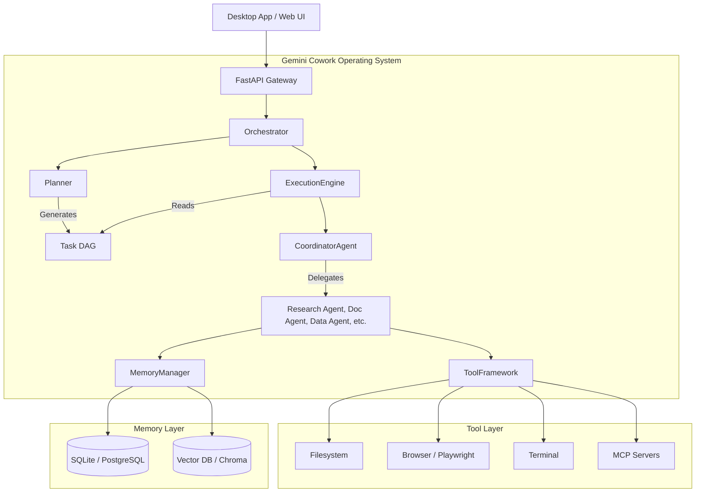

# Gemini Cowork - System Architecture

## 1. Executive Summary
Gemini Cowork is an autonomous knowledge-work operating system. Unlike traditional chat interfaces, it acts as a proactive digital coworker capable of taking high-level goals, decomposing them into a Directed Acyclic Graph (DAG) of tasks, delegating these tasks to specialized agents, and managing tools, memory, and outputs to deliver final production-grade deliverables.

## 2. Core Architecture

## 3. Component Details

### 3.1. The Goal Interpreter & Planner
Transforms natural language requests ("Analyze 500 PDFs") into structured JSON representing a Goal, Dependencies, and Subtasks. It constructs a DAG ensuring agents do not execute tasks before dependencies are resolved.

### 3.2. Multi-Agent System
- **Coordinator Agent**: The "Manager". Routes tasks, resolves execution bottlenecks, and reviews final agent outputs.
- **Worker Agents**: Highly specialized personas with restricted toolsets (e.g., `BrowserAgent` only has access to Playwright and Scraping tools to prevent security risks; `DataAgent` has Python execution in a sandbox).

### 3.3. Tool Framework
A plugin-based tool registry. Tools are atomic, stateless, and declare their schema. Features a strict Security & Permissions layer requiring Human-in-the-Loop (HITL) approval for destructive actions (e.g., sending emails, deleting files).

### 3.4. Memory Architecture
- **Short-Term Memory**: Conversation and active execution context (in-memory/Redis).
- **Long-Term Memory**: Project metadata, user preferences, and structured outcomes (Relational DB).
- **Semantic Memory**: Knowledge base embeddings, document contents (Vector DB).

### 3.5. Security & Human-Approval Layer
Intercepts tool execution requests. If a tool is flagged as `requires_approval=True`, the Execution Engine suspends the agent loop, serializes the state, and pushes a notification to the UI. Execution resumes upon explicit human cryptographic/token approval.
