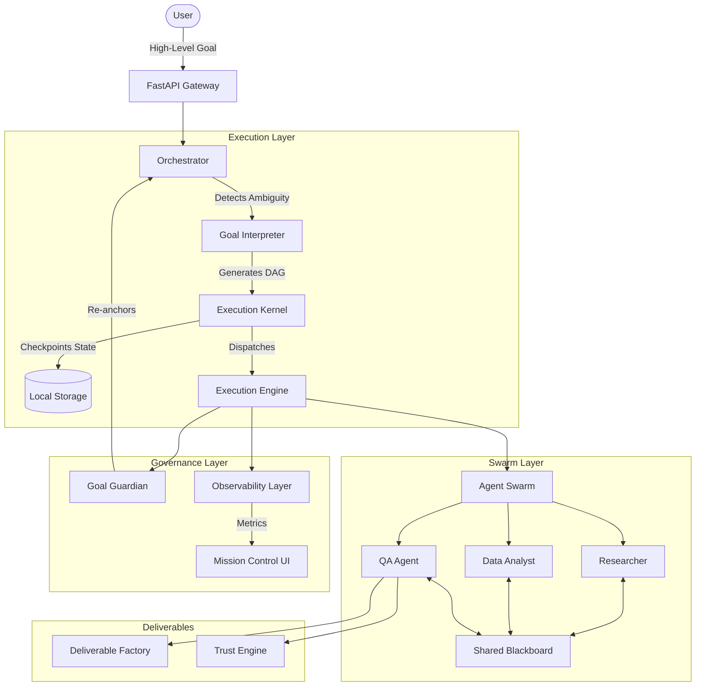

# Architecture Overview

Gemini Cowork OS shifts the focus from "Prompt -> Response" to a persistent, parallel, and observable operating environment.

## Data Flow Diagram

## Component Breakdown

1. **Orchestrator**: The entry point. Runs the user's prompt through the Judgment Engine to detect material ambiguity before executing.
2. **Execution Kernel**: The heart of the OS. Saves the state of the DAG after every step. Detects deadlocks and handles resuming from failure.
3. **Agent Swarm & Blackboard**: An `asyncio`-driven worker pool. Agents post findings to a Shared Blackboard. Findings must be "Promoted" to become Canonical Knowledge.
4. **Goal Guardian**: A supervisory loop that runs every N steps to compare current progress against the original objective to prevent agent drift.
5. **Observability Layer**: Tracks Latency, Tokens, Cost, Meaningful Work Ratio (MWR), and Judgment Accuracy Score (JAS).
6. **Trust Engine**: Maintains the Explainability Graph. `Claim -> Evidence -> Source -> Agent`.
